# 基于 SimCLR 的 AIGC 图像检测实验报告

## 1. 实验概述

本实验基于 CIFAKE 数据集完成真实图像与 AI 生成图像的二分类任务，完成了以下比较任务：

1. 不同的两种 Encoder 预训练数据增强方式效果的对比。
2. 监督学习 baseline 的分类效果与基于 SimCLR 无监督预训练的分类效果进行对比，以及不同 Encoder 模型之间的对比。
3. 附加实验中不同对比学习损失和不同 Projection Head 结构对结果的影响。

## 2. 数据集与实验设置

### 2.1 数据集

实验数据集为 CIFAKE，包含真实图片与 Stable Diffusion 生成图片。当前代码输入尺寸统一为 `32x32`，类别为二分类：

1. `REAL`
2. `FAKE`

当前本地数据集的实际规模如下：

| 数据部分 | REAL | FAKE | 总数 |
| --- | ---: | ---: | ---: |
| 原始训练集 `train/` | 50000 | 50000 | 100000 |
| 原始测试集 `test/` | 10000 | 10000 | 20000 |

在当前代码实现中，对数据集进行了按类别分层切分。具体规则是：

1. 先对原始训练集按类别进行分层划分。
2. 按 `val_ratio=0.2` 从每个类别中划出 `20%` 作为验证集。
3. 剩余 `80%` 样本构成可用于训练的训练池。
4. 对监督 baseline 和 linear probe，再从训练池中按 `labeled_ratio` 抽取 `1%` 或 `10%` 的有标签样本进行训练。
5. 对 SimCLR 预训练，则直接使用 `train/` 下全部 `100000` 张图片，丢弃标签，仅进行无监督对比学习。

按照当前代码的划分方式，可得到以下实际规模：

| 用途 | REAL | FAKE | 总数 |
| --- | ---: | ---: | ---: |
| SimCLR 预训练集 | 50000 | 50000 | 100000 |
| 验证集 | 10000 | 10000 | 20000 |
| 训练池 | 40000 | 40000 | 80000 |
| `1%` 有标签训练集 | 400 | 400 | 800 |
| `10%` 有标签训练集 | 4000 | 4000 | 8000 |
| 最终测试集 | 10000 | 10000 | 20000 |

### 2.2 Encoder模型设置

实验中使用了两种 Encoder：

1. `ResNet-18`
2. `MobileNetV2`

#### 2.2.1 适应 `32x32` 输入修改首层结构

`ResNet-18` 和 `MobileNetV2` 的最初主要是用于 ImageNet 这类较大分辨率输入，输入大小通常为 `224x224`。网络会在最开始几层进行较强的空间下采样，以快速减小特征图尺寸，并扩大感受野。这种设计如果直接用于 `32x32` 小图像，就会丢失空间细节。

通过简单的计算我们可以看到：

1. 如果对 `32x32` 图像直接使用 `7x7, stride=2` 的大卷积，特征图会先从 `32x32` 变成 `16x16`。
2. 如果后面再接一个 `3x3, stride=2` 的最大池化，特征图会继续变成 `8x8`。
3. 也就是说，网络刚开始不久，空间分辨率就已经只剩原来的四分之一甚至更少。

因此，为了让网络在前几层保留更多 `32x32` 输入中的空间细节，要对网络的第一层进行一定的修改。

对应到代码中，具体修改如下：

1. `ResNet-18`：将首层卷积从大卷积改为 `3x3, stride=1, padding=1`，并移除最大池化层。
2. `MobileNetV2`：保留首层 `3x3` 卷积，但把步长从 `2` 改为 `1`。

这两种改法都是避免在网络最开始就把 `32x32` 图像压缩得过快，从而让后续网络能够在更高分辨率的特征图上进行学习。

#### 2.2.2 ResNet-18 网络结构

`ResNet-18` 的核心思想是残差学习。它通过残差连接，减轻深层网络训练中的梯度消失问题，并提高优化稳定性。

适配 `32x32` 输入后的版本其整体结构可以表示为：

```text
Input 3x32x32
-> Conv 3x3, 64, stride=1
-> BatchNorm
-> ReLU
-> Layer1: 2 x BasicBlock(64)
-> Layer2: 2 x BasicBlock(128, first block stride=2)
-> Layer3: 2 x BasicBlock(256, first block stride=2)
-> Layer4: 2 x BasicBlock(512, first block stride=2)
-> Global Average Pooling
-> Fully Connected / Identity
```

其中一个 `BasicBlock` 的基本形式为：

```text
x
-> Conv 3x3
-> BatchNorm
-> ReLU
-> Conv 3x3
-> BatchNorm
+ shortcut(x)
-> ReLU
```

若输入输出通道数不同，或者该 block 负责下采样，则 shortcut 分支也会通过 `1x1` 卷积和步长调整完成维度匹配。

下表给出本实验中 `ResNet-18` 各层的输入输出维度：

| 阶段 | 结构 | 输出通道 | 空间尺寸变化 |
| --- | --- | --- | --- |
| Stem | `3x3 Conv + BN + ReLU` | 64 | `32x32 -> 32x32` |
| Layer1 | `2 x BasicBlock` | 64 | `32x32 -> 32x32` |
| Layer2 | `2 x BasicBlock` | 128 | `32x32 -> 16x16` |
| Layer3 | `2 x BasicBlock` | 256 | `16x16 -> 8x8` |
| Layer4 | `2 x BasicBlock` | 512 | `8x8 -> 4x4` |
| Head | `GAP + FC/Identity` | 512 | `4x4 -> 1x1` |

#### 2.2.3 MobileNetV2 网络结构

`MobileNetV2` 的核心思想是轻量化卷积网络设计。它通过 depthwise separable convolution 大幅减少参数量和计算量，并提出了 inverted residual + linear bottleneck 结构。

适配 `32x32` 输入后的版本其结构主线可以表示为：

```text
Input 3x32x32
-> Conv 3x3, stride=1
-> Inverted Residual Stage t=1, c=16, n=1, s=1
-> Inverted Residual Stage t=6, c=24, n=2, s=2
-> Inverted Residual Stage t=6, c=32, n=3, s=2
-> Inverted Residual Stage t=6, c=64, n=4, s=2
-> Inverted Residual Stage t=6, c=96, n=3, s=1
-> Inverted Residual Stage t=6, c=160, n=3, s=2
-> Inverted Residual Stage t=6, c=320, n=1, s=1
-> Conv 1x1
-> Global Average Pooling
-> Fully Connected / Identity
```

其中，`Inverted Residual Block` 的结构为：

```text
x
-> 1x1 Pointwise Conv (expand channels)
-> Depthwise 3x3 Conv
-> 1x1 Pointwise Conv (project channels)
+ shortcut(x) when shape matches
```

它与传统残差块相比有两个关键区别：

1. 先扩张通道，再做 depthwise convolution，而不是先压缩。
2. 输出端使用 linear bottleneck，不在最后再接非线性激活，以减少低维空间的信息破坏。

下表给出本实验中 `MobileNetV2` 各层的输入输出维度：

| 阶段 | 结构 | 主要参数 | 空间尺寸变化 |
| --- | --- | --- | --- |
| Stem | `3x3 Conv` | stride=1 | `32x32 -> 32x32` |
| Stage1 | Inverted Residual | `t=1, c=16, n=1, s=1` | `32x32 -> 32x32` |
| Stage2 | Inverted Residual | `t=6, c=24, n=2, s=2` | `32x32 -> 16x16` |
| Stage3 | Inverted Residual | `t=6, c=32, n=3, s=2` | `16x16 -> 8x8` |
| Stage4 | Inverted Residual | `t=6, c=64, n=4, s=2` | `8x8 -> 4x4` |
| Stage5 | Inverted Residual | `t=6, c=96, n=3, s=1` | `4x4 -> 4x4` |
| Stage6 | Inverted Residual | `t=6, c=160, n=3, s=2` | `4x4 -> 2x2` |
| Stage7 | Inverted Residual | `t=6, c=320, n=1, s=1` | `2x2 -> 2x2` |
| Head | `1x1 Conv + GAP + FC/Identity` | 高维特征映射 | `2x2 -> 1x1` |

### 2.3 SimCLR 设置

SimCLR 结构由两部分组成：

1. Encoder
2. Projection Head：`Linear -> ReLU -> Linear`

默认主实验中的对比学习损失为 `NT-Xent`，投影维度为 `64`。

### 2.4 训练设置

本实验的训练设置分为主实验设置与附加实验设置两部分。

#### 2.4.1 主实验超参数

| 模块 | 超参数 | 取值 |
| --- | --- | --- |
| 通用 | DataLoader 进程数 `num_workers` | `4` |
| 通用 | 验证集比例 `val_ratio` | `0.2` |
| 通用 | 测试指标 | `Accuracy`, `F1 Score` |
| baseline / linear probe | 标签比例 `labeled_ratio` | `0.01`, `0.1` |
| baseline | backbone | `resnet18`, `mobilenet_v2` |
| baseline | 训练轮数 `epochs` | `10` |
| baseline | batch size | `128` |
| baseline | 学习率 `lr` | `1e-3` |
| baseline | 权重衰减 `weight_decay` | `1e-4` |
| SimCLR 预训练 | backbone | `resnet18`, `mobilenet_v2` |
| SimCLR 预训练 | 增强方式 `augment` | `simclr_v1`, `simclr_v2` |
| SimCLR 预训练 | 训练轮数 `epochs` | `20` |
| SimCLR 预训练 | batch size | `256` |
| SimCLR 预训练 | 学习率 `lr` | `1e-3` |
| SimCLR 预训练 | 权重衰减 `weight_decay` | `1e-4` |
| SimCLR 预训练 | 温度系数 `temperature` | `0.5` |
| SimCLR 预训练 | 投影维度 `projection_dim` | `64` |
| SimCLR 预训练 | 投影头隐藏层维度 `projection_hidden_dim` | `None`，即默认等于 encoder 输出维度 |
| linear probe | 训练轮数 `epochs` | `10` |
| linear probe | batch size | `128` |
| linear probe | 学习率 `lr` | `1e-3` |
| linear probe | 权重衰减 `weight_decay` | `1e-4` |
| final test | batch size | `256` |

#### 2.4.2 主实验设置汇总

| 实验阶段 | 训练数据 | 是否使用标签 | 模型主体 | 优化器设置 | 优化目标 |
| --- | --- | --- | --- | --- | --- |
| baseline | `1%` 或 `10%` 有标签训练集 | 是 | 随机初始化的 `ResNet18` / `MobileNetV2` | `Adam`, `lr=1e-3`, `weight_decay=1e-4` | 交叉熵分类损失 |
| SimCLR 预训练 | 全部 `100000` 张训练图片 | 否 | Encoder + Projection Head | `Adam`, `lr=1e-3`, `weight_decay=1e-4` | NT-Xent 对比学习损失 |
| linear probe | `1%` 或 `10%` 有标签训练集 | 是 | 冻结 Encoder + 新线性分类器 | `Adam`, `lr=1e-3`, `weight_decay=1e-4` | 交叉熵分类损失 |
| final test | 全部 `20000` 张测试图片 | 是 | 训练完成后的最佳模型 | 不涉及参数更新 | 测试集评估 |

#### 2.4.3 数据增强设置

本实验中的数据增强分为三类：

1. 监督学习 baseline 与 linear probe 的训练增强。
2. SimCLR 的 `simclr_v1` 增强流。
3. SimCLR 的 `simclr_v2` 增强流。

其中，SimCLR 预训练阶段会对同一张原图随机生成两个 view。两个 view 使用同一套增强规则，但因为每次增强是随机的，同一张图会得到两个不同的增强结果。

##### 1. 监督学习 baseline / linear probe 训练增强

训练阶段的增强流水线为：

`Resize -> RandomCrop -> RandomHorizontalFlip -> ColorJitter -> ToTensor -> Normalize`

说明如下：

| 增强操作 | 含义 | 参数设置 |
| --- | --- | --- |
| `Resize((32, 32))` | 将输入统一缩放到网络所需的 `32x32` 尺寸 | `image_size=32` |
| `RandomCrop(32, padding=4)` | 随机平移或位置变化 | `size=32`, `padding=4` |
| `RandomHorizontalFlip()` | 随机左右翻转图像 | 默认 `p=0.5` |
| `ColorJitter(...)` | 随机改变亮度、对比度、饱和度和色调等 | `brightness=0.2`, `contrast=0.2`, `saturation=0.2`, `hue=0.05` |
| `ToTensor()` | 图像转换为张量 | 无 |
| `Normalize(mean, std)` | 标准化 | `mean=(0.4914, 0.4822, 0.4465)`, `std=(0.2470, 0.2435, 0.2616)` |

验证与测试阶段不使用随机增强，仅保留：

`Resize((32, 32)) -> ToTensor() -> Normalize(mean, std)`

##### 2. SimCLR 增强方式 `simclr_v1`

`simclr_v1` 的增强流水线为：

`RandomResizedCrop -> RandomHorizontalFlip -> RandomApply(RandomRotation) -> RandomApply(ColorJitter) -> RandomGrayscale -> RandomApply(GaussianBlur) -> ToTensor -> Normalize`

说明如下：

| 增强操作 | 含义 | 参数设置 |
| --- | --- | --- |
| `RandomResizedCrop(32, scale=(0.5, 1.0))` | 从原图中随机裁剪一个比例在 `50%` 到 `100%` 之间的区域，再缩放回 `32x32` | `size=32`, `scale=(0.5, 1.0)` |
| `RandomHorizontalFlip()` | 随机左右翻转 | 默认 `p=0.5` |
| `RandomApply([RandomRotation(15)], p=0.3)` | 随机旋转 | `degrees=15`, `p=0.3` |
| `RandomApply([ColorJitter(...)], p=0.8)` | 以较高概率做颜色扰动 | `brightness=0.8`, `contrast=0.8`, `saturation=0.8`, `hue=0.2`, `p=0.8` |
| `RandomGrayscale(p=0.2)` | 随机转为灰度图 | `p=0.2` |
| `RandomApply([GaussianBlur(...)], p=0.5)` | 随机施加高斯噪声 | `kernel_size=3`, `sigma=(0.1, 2.0)`, `p=0.5` |
| `ToTensor()` | 转为张量 | 无 |
| `Normalize(mean, std)` | 标准化 | `mean=(0.4914, 0.4822, 0.4465)`, `std=(0.2470, 0.2435, 0.2616)` |

第一组增强更偏向颜色扰动、灰度化和模糊。

##### 3. SimCLR 增强方式 `simclr_v2`

`simclr_v2` 的增强流水线为：

`RandomResizedCrop -> RandomHorizontalFlip -> RandomApply(RandomAffine) -> RandomAutocontrast -> RandomEqualize -> RandomApply(RandomPosterize) -> RandomSolarize -> ToTensor -> Normalize`

逐项说明如下：

| 增强操作 | 含义 | 参数设置 |
| --- | --- | --- |
| `RandomResizedCrop(32, scale=(0.35, 1.0))` | 随机裁剪比例更大，允许只保留原图 `35%` 到 `100%` 的区域，再缩放回 `32x32`，比 `simclr_v1` 裁剪更激进 | `size=32`, `scale=(0.35, 1.0)` |
| `RandomHorizontalFlip()` | 随机左右翻转 | 默认 `p=0.5` |
| `RandomApply([RandomAffine(...)], p=0.8)` | 以较高概率施加平移、缩放和剪切 | `degrees=0`, `translate=(0.15, 0.15)`, `scale=(0.8, 1.2)`, `shear=12`, `p=0.8` |
| `RandomAutocontrast(p=0.5)` | 自动拉伸图像对比度范围 | `p=0.5` |
| `RandomEqualize(p=0.3)` | 对直方图做均衡化处理，改变整体亮度分布 | `p=0.3` |
| `RandomApply([RandomPosterize(bits=3)], p=0.4)` | 随机降低颜色位深 | `bits=3`, `p=0.4` |
| `RandomSolarize(threshold=128, p=0.3)` | 随机对高于阈值的像素做反相 | `threshold=128`, `p=0.3` |
| `ToTensor()` | 转为张量 | 无 |
| `Normalize(mean, std)` | 标准化 | `mean=(0.4914, 0.4822, 0.4465)`, `std=(0.2470, 0.2435, 0.2616)` |

第二组增强更偏向几何仿射变换和色调的重新映射，与第一组之间有明显差异。

#### 2.4.4 附加实验超参数

附加实验 1 和附加实验 2 在默认设置下均固定：

1. `model=resnet18`
2. `augment=simclr_v1`
3. `labeled_ratio=0.1`
4. `val_ratio=0.2`

在此基础上仅改变对应实验所需比较的因素。

附加实验 1：不同对比学习损失比较。

| 超参数 | 取值 |
| --- | --- |
| backbone | `resnet18` |
| augment | `simclr_v1` |
| labeled_ratio | `0.1` |
| pretrain epochs | `20` |
| pretrain batch size | `256` |
| pretrain lr | `1e-3` |
| pretrain weight decay | `1e-4` |
| temperature | `0.5` |
| margin | `1.0` |
| projection_dim | `64` |
| projection_hidden_dim | `None` |
| probe epochs | `10` |
| probe batch size | `128` |
| probe lr | `1e-3` |
| probe weight decay | `1e-4` |
| compared losses | `nt_xent`, `triplet`, `contrastive` |

附加实验 2：Projection Head 结构分析。

| 超参数 | 取值 |
| --- | --- |
| backbone | `resnet18` |
| augment | `simclr_v1` |
| labeled_ratio | `0.1` |
| pretrain epochs | `20` |
| pretrain batch size | `256` |
| pretrain lr | `1e-3` |
| pretrain weight decay | `1e-4` |
| temperature | `0.5` |
| projection_dim | `64` |
| projection_hidden_dim | `None` |
| wide_multiplier | `2.0` |
| probe epochs | `10` |
| probe batch size | `128` |
| probe lr | `1e-3` |
| probe weight decay | `1e-4` |
| compared heads | `mlp`, `mlp_bn`, `mlp_wide` |

## 3. 数据增强展示

### 3.1 SimCLR 增强方式 1

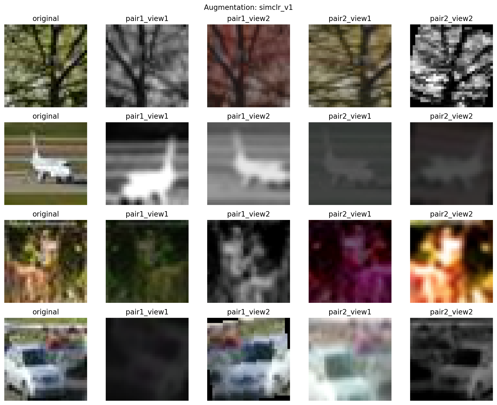

### 3.2 SimCLR 增强方式 2

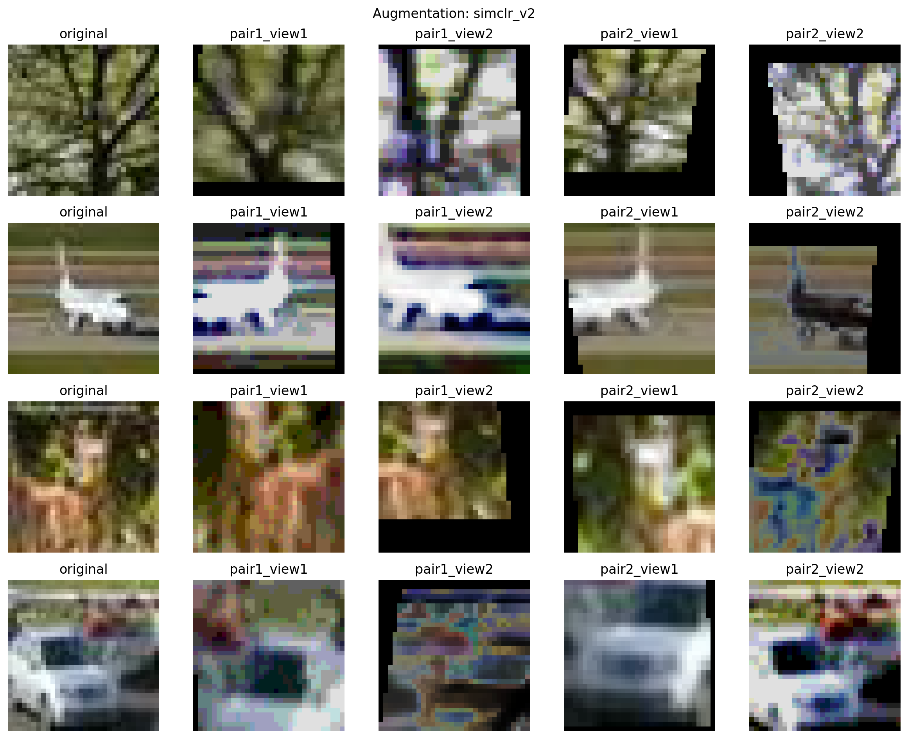

## 4. 主实验结果

### 4.1 ResNet18 在不同增强流下预训练以及后续分类损失对比

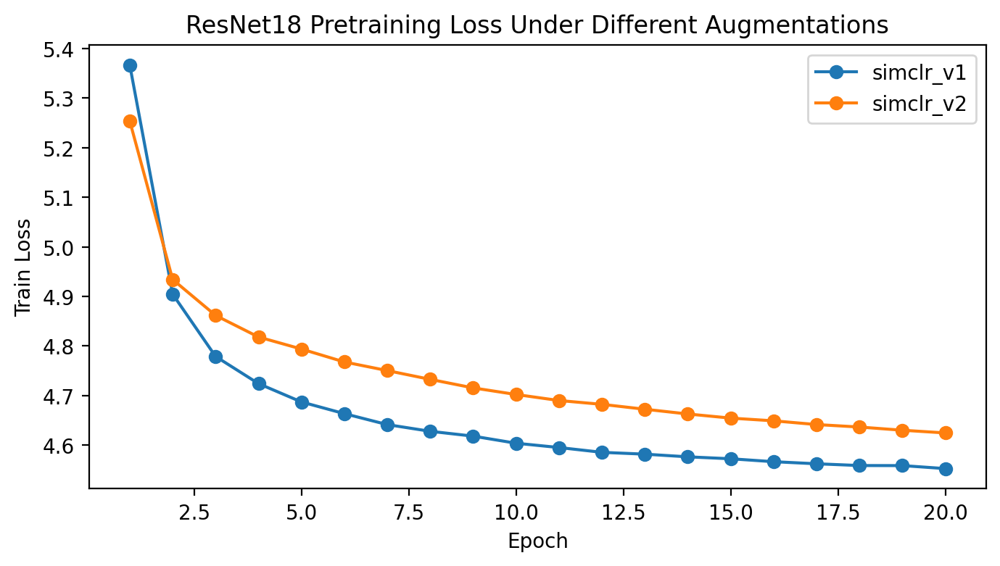

该图展示 `simclr_v1` 与 `simclr_v2` 两种增强方式下，ResNet18 在 SimCLR 预训练阶段的训练损失变化趋势。为了进一步比较两种增强流在下游分类阶段的影响，下面后续线性分类器得到的训练曲线对比图。图中比较了两种预增强流在后续 `label10%` 设置下的训练损失、验证损失、验证准确率与验证 F1。

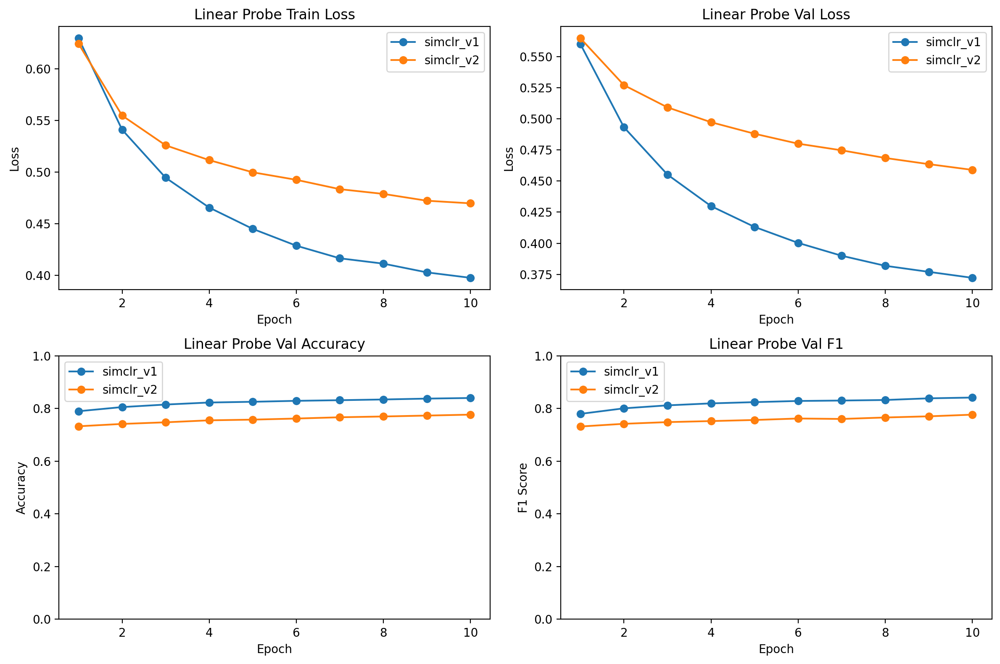

可以看出，在当前已跑出的 `ResNet18 + label10%` 线性评估结果中，`simclr_v1` 的收敛速度和最终验证指标均优于 `simclr_v2`，因此后续主实验默认采用 `simclr_v1` 作为预训练增强流。

### 4.2 主实验结果分组比较

为简化记号，下面统一使用：

1. `r0.1` 表示 `ResNet18 + 10%` 标签比例。
2. `r0.01` 表示 `ResNet18 + 1%` 标签比例。
3. `m0.1` 表示 `MobileNetV2 + 10%` 标签比例。
4. `m0.01` 表示 `MobileNetV2 + 1%` 标签比例。

#### 4.2.1 每种网络设置内部：baseline 与 SimCLR 的比较

下图按四种网络设置分别展示了 `baseline` 与 `SimCLR + linear probe` 在训练阶段的验证损失和验证准确率曲线。每一列对应一种固定设置，因此可以直接观察同一设置内两种方法的收敛过程差异。

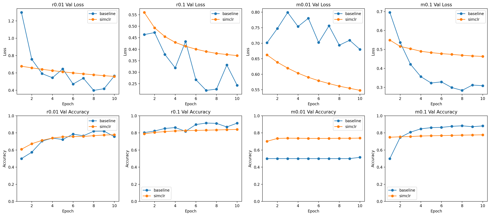

从训练曲线可以看出：

1. `r0.01` 中，SimCLR 的验证准确率与 baseline 接近，整体波动也更小，说明在极少标签场景下，预训练表征可以弥补一部分监督信息不足。
2. `r0.1` 中，baseline 的验证损失下降更充分，最终验证准确率也更高，说明当 `ResNet18` 已有 `10%` 标签可用时，直接监督训练已经足够有效。
3. `m0.01` 中，SimCLR 相比 baseline 有明显优势，这是主实验中最典型的 SimCLR 获益场景，也说明轻量模型在低标签条件下更依赖预训练特征。
4. `m0.1` 中，baseline 展现出明显优势，说明当 `MobileNetV2` 拥有更多标签时，监督学习也能够逐步弥补模型表达能力的不足。

下面给出四种设置下 baseline 与 SimCLR 的最终测试结果比较。

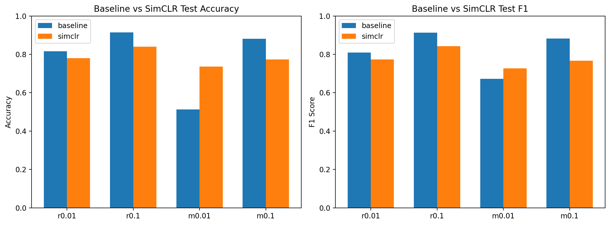

从测试结果看，`ResNet18` 两组设置均是 baseline 更优；`MobileNetV2` 中只有 `m0.01` 是 SimCLR 更优，而 `m0.1` 仍是 baseline 更优。这说明 SimCLR 的收益与 Encoder 结构以及标签量都有关，不是对所有设置都必然提升。但从 `m0.01` 这一组可以看出，在模型轻量化且标签稀缺的背景下，SimCLR 的确能够显著改善最终分类效果。

#### 4.2.2 仅在 SimCLR 内部：四种网络设置之间的比较

下图仅保留 SimCLR 方法，比较 `r0.1`、`r0.01`、`m0.1`、`m0.01` 四种设置之间的训练过程差异。图中给出了训练损失、验证损失、验证准确率和验证 F1 的整体对比。

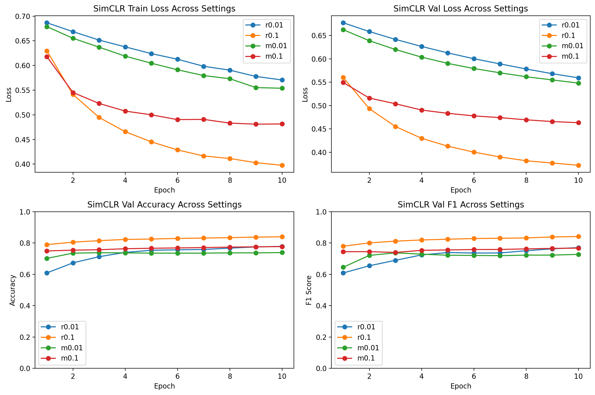

从训练过程上看，`r0.1` 的收敛效果最好，`r0.01` 次之，`m0.1` 与 `m0.01` 整体落后于 `ResNet18`。这说明在当前主实验中，SimCLR 预训练后的线性分类效果对 backbone 选择较为敏感，`ResNet18` 明显更适合作为下游分类的 encoder；而 `MobileNetV2` 作为轻量化模型，表达能力相对更弱。

下面给出四种 SimCLR 设置之间的最终测试结果比较。

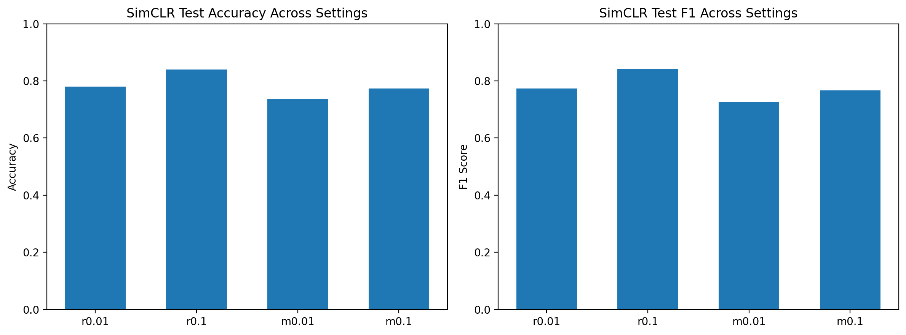

测试结果进一步验证了这一点：`r0.1` 最优，`r0.01` 第二，`m0.1` 第三，`m0.01` 最低。说明在当前实现与数据划分下，增加标签比例仍然能够显著提升 SimCLR 下游性能，而 `ResNet18` 也整体优于 `MobileNetV2`。

为了更直观地展示差异，下面给出了 `label10%` 条件下两种 SimCLR 结果的测试混淆矩阵。图一是`ResNet18`，图二是`MobileNetV2`。

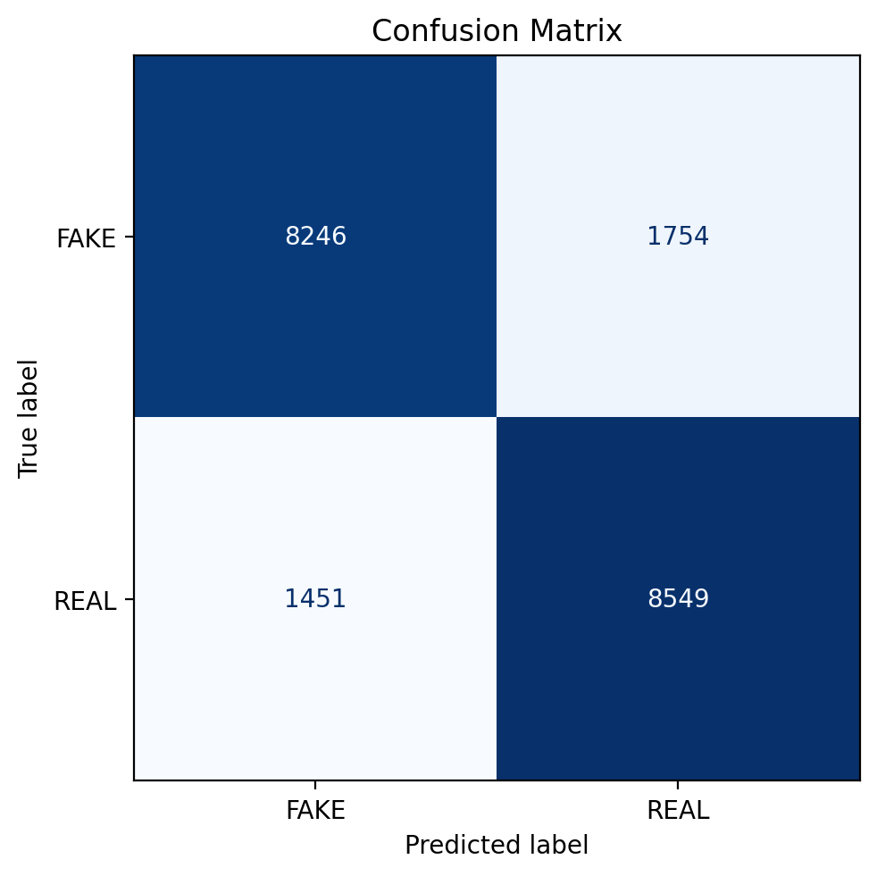

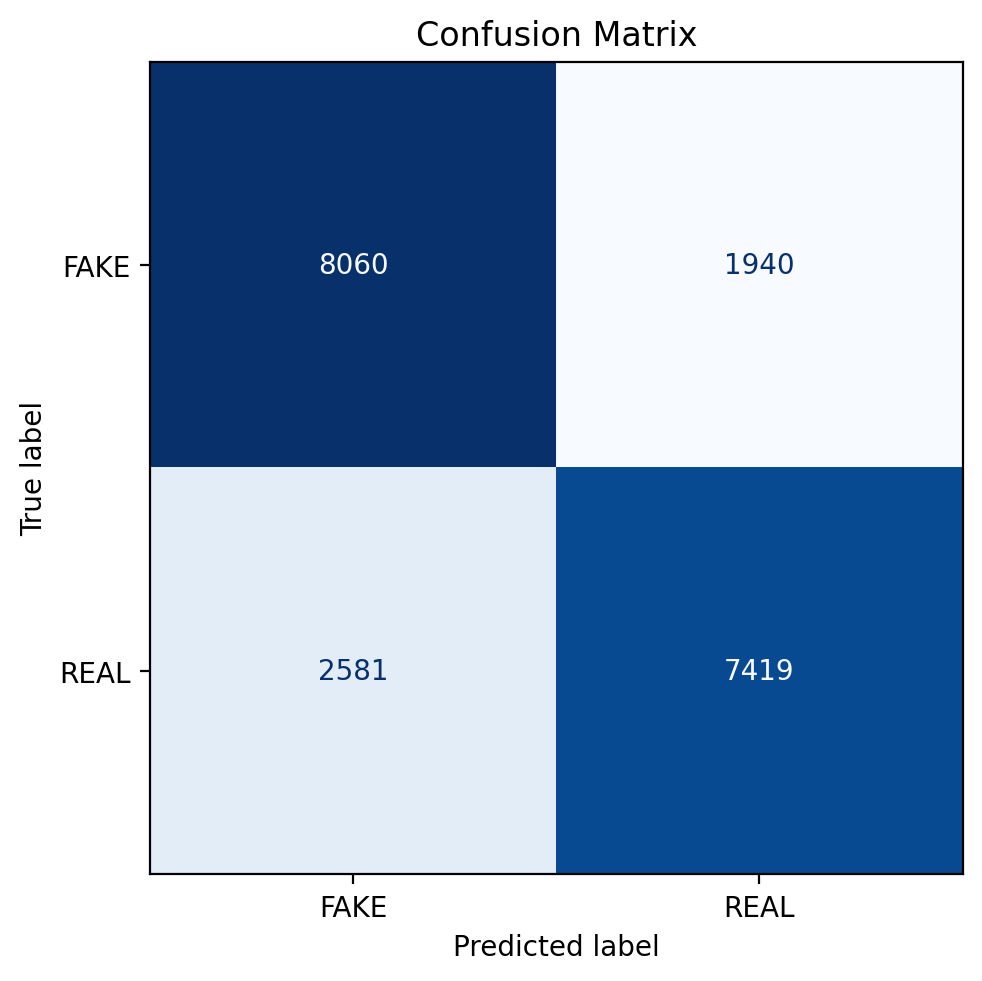

可以看到，在同样条件下，`ResNet18` 的主对角线更清晰，误分区域更少；`MobileNetV2` 则存在更多交叉误分。

## 5. 附加实验

### 5.1 附加实验 1：不同对比学习损失比较

本附加实验固定以下设置不变：

1. Encoder 为 `ResNet18`。
2. 数据增强方式固定为 `simclr_v1`。
3. 有标签比例固定为 `10%`。
4. 仅改变 SimCLR 预训练阶段的对比学习损失函数，分别比较 `NT-Xent`、`Triplet` 和 `Contrastive`。

#### 5.1.1 预训练阶段损失曲线比较

下图给出了三种损失函数在预训练阶段的训练损失变化。由于三种损失的定义不同，loss 的绝对数值不具有可比性，这里主要展示各自的下降趋势和收敛稳定性。

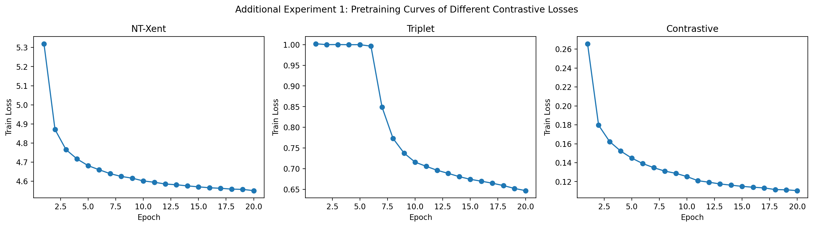

从预训练曲线可以看出：

1. `NT-Xent` 的损失在整个训练过程中持续平滑下降，收敛过程最稳定。
2. `Triplet` 在前几个 epoch 基本停留在较高平台，之后才出现明显下降。
3. `Contrastive` 下降速度也较快，但是平滑度上整体与`NT-Xent`还是有一定不足。

#### 5.1.2 下游分类器训练过程比较

为了比较预训练表征在下游分类阶段的质量，下面给出三种损失在相同 分类器设置下的训练损失、验证损失、验证准确率和验证 F1 曲线。

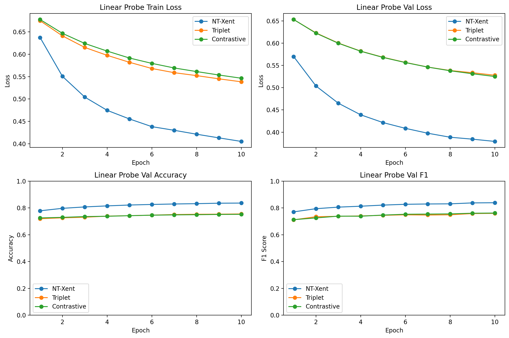

从下游训练曲线可以看出：

1. `NT-Xent` 在验证损失、验证准确率和验证 F1 三个指标上都明显优于另外两种损失。
2. `Triplet` 与 `Contrastive` 的整体表现比较接近。
3. 三种方法都能稳定收敛，但只有 `NT-Xent` 能够把验证准确率提升到 `0.8` 以上，说明它更适合当前 AIGC 图像检测任务。

#### 5.1.3 最终测试结果比较

下图汇总了三种损失函数对应模型在测试集上的最终结果。

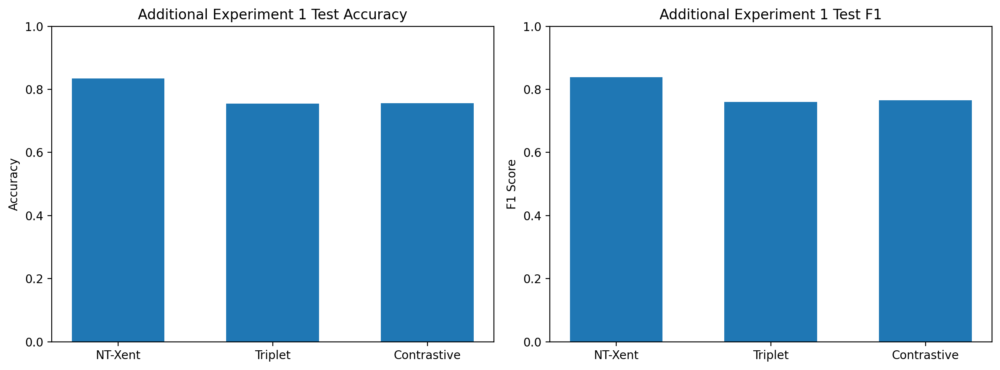

最终测试结果如下：

1. `NT-Xent`：`Accuracy=0.8346`，`F1=0.8382`。
2. `Contrastive`：`Accuracy=0.7558`，`F1=0.7658`。
3. `Triplet`：`Accuracy=0.7546`，`F1=0.7598`。

可以看到，`NT-Xent` 明显优于另外两种损失。其中相对于表现第二好的 `Contrastive`，`NT-Xent` 测试准确率提高了约 `7.88%`，测试 F1 提高了约 `7.24%`。

为下面给出三种方法在测试集上的混淆矩阵。

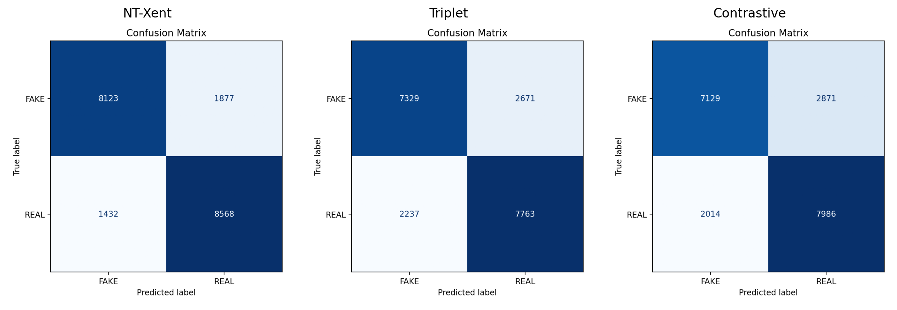

从混淆矩阵可以看到，`NT-Xent` 的主对角线最清晰；`Triplet` 和 `Contrastive` 虽然也能形成基本分类边界，但交叉误分明显更多。总的来说：在本实验设定下，`NT-Xent` 是三种候选损失中效果最好的选择，因此主实验采用它作为默认对比学习目标是合理的。

### 5.2 附加实验 2：Projection Head 结构分析

建议在完成附加实验 2 运行后补充：

1. `mlp / mlp_bn / mlp_wide` 的预训练损失曲线对比图
2. 不同 head 结构在 `label10` 下的线性评估测试指标表格
3. 对 BatchNorm 和隐藏层宽度变化影响的分析
